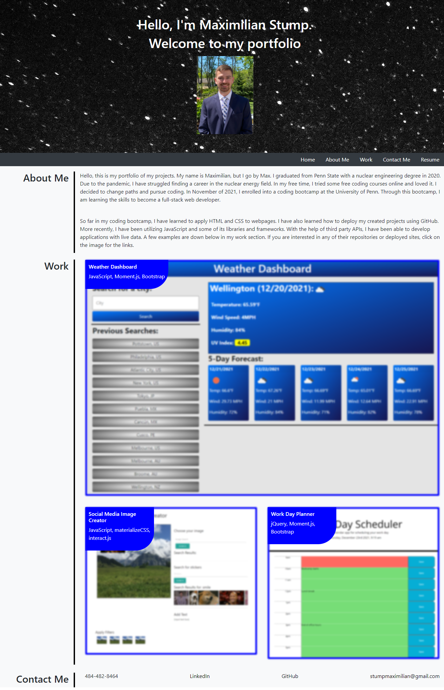
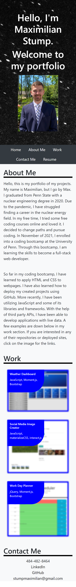
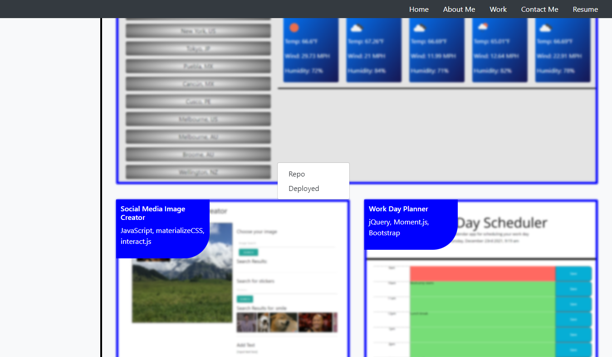

# professional-portfolio

## Description
I was tasked with updating my professional portfolio to demonstrate personal projects to future employers. The goal was to make a webpage that is visually appealing with access to projects I have completed. Utilizing Bootstrap, I was able to create a structured webpage that is both desktop and mobile friendly. I was able to include images with dropdown menus containing links to my projects and repos. I structured my HTML with semantic elements and alt tags for more accessibility. During the creation of my portfolio, I learned how to use different components of Bootstrap, specifically the dropdown menus and image overlay.

## Table of Contents
- [Installation](#installation)
- [Usage](#usage)
- [Credits](#credits)
- [License](#license)
- [Features](#features)

## Installation
N/A

## Usage
Here is the deployed link to my portfolio. [My portfolio](https://maxstump13.github.io/professional-portfolio/) Below is what the site looks like on screens larger than 768px and screens smaller than 768px. 

The navigation follows at the top as you scroll down. The images are clickable to open a dropdown menu. These menus have the links to the repos and the deployed applications. These features are displayed below. 

If one of the headers in the navigation is clicked, a scroll animation to that section is triggered. If the Resume header is clicked, another tab is opened to a resume. In the Work section, the images are blurred until hovered over.  At the bottom, my contact information and profiles are listed with active links. 

## Credits
Here are the sources I used to create my portfolio.
1. [CSS-tricks](https://css-tricks.com/)
2. [Stackoverflow](https://stackoverflow.com/)
3. [W3schools](https://www.w3schools.com/default.asp)
4. [MDN](https://developer.mozilla.org/en-US/)
5. [unsplash](https://unsplash.com/)
6. [Bootstrap](https://getbootstrap.com/)

## License
[Mit Licesne](./LICENSE)

## Badges
N/A

## Features
1. Scroll animation when navigation clicked
2. Resume opens in new tab
3. Images in work section have bootstrap dropdown menu with repo/deployed links
4. Links in contact me go to profiles
5. Images are blurred until hovered on
6. Structure uses bootstrap to adjusts to smaller screens for easier use
7. Navigation bar sticks to the top when scrolled by

## How to Contribute
If there are any suggestions to improve this generator, this is my [GitHub](https://github.com/MaxStump13) account.

## Tests
N/A